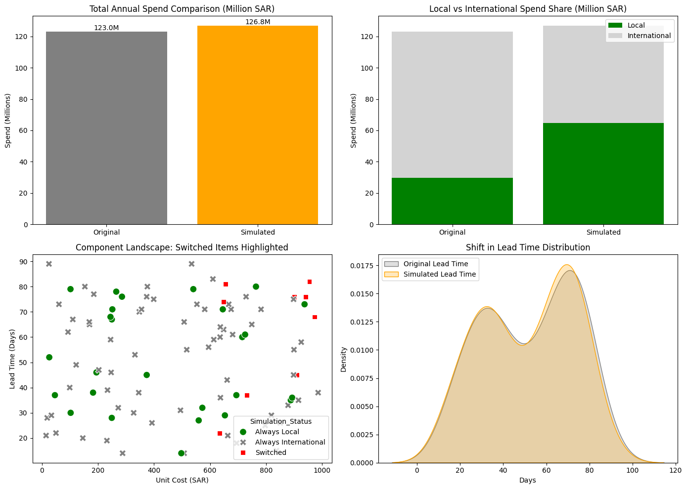

# Saudi Defense Localization Simulator (Vision 2030)

## 📌 Executive Summary
This project is a data-driven simulation tool designed to model the strategic localization of defense procurement within Saudi Arabia. By analyzing a 100-component Bill of Materials (BOM), the simulator identifies the optimal shift from international suppliers to local SMEs to meet national security and economic goals.

## 🧠 The Theory: The Cost-Speed Trade-off
In supply chain management, localization is a strategic decision between **Procurement Cost** and **Operational Readiness**. 

* **International Sourcing**: Offers lower unit costs due to global economies of scale but introduces "Lead Time Friction" (waiting for shipping/customs).
* **Local Sourcing**: Requires a "Localization Premium" (upfront investment in domestic capacity) but delivers "Operational Velocity" (faster part replacement and higher readiness).

This model uses a **Heuristic Optimization** approach to select components for localization based on their impact on overall supply chain speed vs. their cost-to-produce ratio.

## 📊 Key Results (At 51% Localization)
Based on the current model calibration:
* **Lead Time Improvement**: -8.94 Days (Average reduction across the supply chain).
* **Localization Premium**: 49,000,000 SAR (Total spend variance).
* **National Impact**: Directly supports the Vision 2030 goal of localizing 50% of military spending.

## 🛠️ Tech Stack
* **Language**: Python 3.9+
* **Framework**: Streamlit (Dashboard UI)
* **Data Handling**: Pandas & NumPy
* **Visualization**: Plotly & Matplotlib

## 🚀 How to Run
1. Clone the repo: `git clone https://github.com/almon030-cloud/SAMI-Localization-Simulator.git`
2. Install dependencies: `pip install -r requirements.txt`
3. Run the app: `streamlit run app.py`

---
**Author**: Saud Almonaiseer  
* Student | University of Minnesota*
